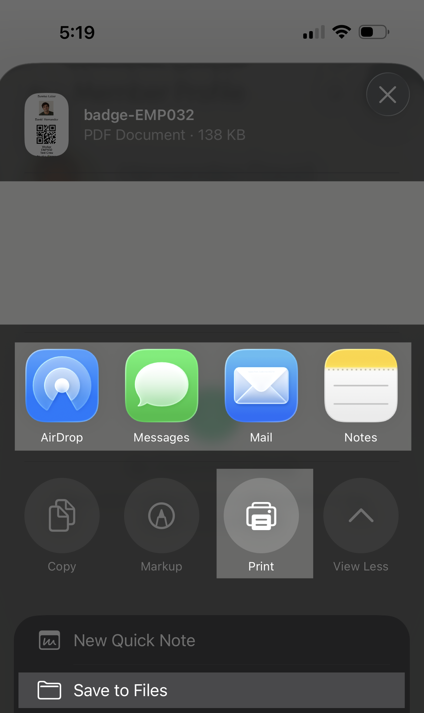

## Quickstart Guide

[Add Quickstart feature headings and documentation here.]

---

## Employees & Crews

### Add one employee

1. Select the **Crew** page  from the bottom menu.

2. Select the + button in the top right of the page.

3. Enter the employee's first name, last name, and employee ID.\*

_\*Optional: Add a custom pay rate for the employee._

4. Select **Create Member** to save your new employee.

---

### Update employee details

1. Select the **Crew** page  from the bottom menu.

2. Select the **Search** box above the employee list.
3. Enter the employee's first name, last name, or Employee ID.
4. Select the employee you want to update.

5. Select the edit button  on the employee's profile.

6. Update the employee's first name, last name, employee ID, custom rate, member status, or profile picture.
7. Select **Update Profile** to save your changes.

---

### Export an employee badge

1. Select the **Crew** page  from the bottom menu.

2. Select the **Search** box above the employee list.
3. Enter the employee's first name, last name, or Employee ID.
4. Select the employee you want to update.

5. Select the **export** button  in the top right of the page.

You can save, share, or print the employee badge.

---

### Find an employee's current hourly rate

Select the **Crew** page  from the bottom menu.

2. Select the **Search** box above the employee list.
3. Enter the employee's first name, last name, or Employee ID.
4. Select the employee you want to update.

The employee's hourly rate is listed next to the Employee ID.

---

### View all employee roles

[Add documentation here.]

---

### View all crews

[Add documentation here.]

---

## Ranches & Locations

### View all ranches by grower

1. On the **Home Page**, select **Create time card**.

2. Select the **Grower** from the dropdown menu.

3. Select the **Ranch** dropdown menu to see all ranches for that grower.

---

### View locations by ranch

1. On the **Home Page**, select **Create time card**.

2. Select the **Grower** from the dropdown menu. 

3. Select the **Ranch** from the dropdown menu. 

4. Select the **Location** dropdown menu to see all locations for that ranch.

---

## Pay Periods & Jobs

### View organization pay periods

1. On the **Home Page**, select **View all** under **Pending Approval**.

2. Select the **Period** at the top of the page.
   

This is the list of all of the pay periods for the calendar year.

---

### View all active jobs for an organization

On the **Home Page**, select **Create time card**.

2. Select the **Grower** from the dropdown menu. 

3. Select the **Ranch** from the dropdown menu. 

4. Select the **Location** from the dropdown menu. 

5. Select the **Job** dropdown menu to see all active jobs in the organization.

---

## Creating & Viewing Time Cards

### Create a new time card (for a past date)

On the **Home Page**, select **Create time card**.

2. Select the **Grower** from dropdown menu. 

3. Select the **Ranch** from the dropdown menu. 

4. Select the **Location** from the dropdown menu. 

5. Select the **Job** from the dropdown menu.

---

### View all timecards for an organization in a pay period

1. On the **Home Page**, select **View all** under **Pending Approval**.

2. Select the **Period** at the top of the page.
   

This is the list of all of the pay periods for the calendar year.

1. On the **Home Page**, select **View all** under **Pending Approval**.

2. Select the **Period** at the top of the page.
   
3. Select the pay period you want to view. 

4. This is the list of all of the time cards within this pay period.

---

### Find a time card

[Add documentation here.]

---

## Managing Employees in an Existing Time Card

### View all employees in an existing time card

1. On the **Home Page**, select **View all** under **Pending Approval**.

2. Select the **Period** at the top of the page.
   
3. Select the time card you want to view.
   
4. Select the edit button.

5. Select **Manage employees**.

6. All employees currently on the timecard are listed under **Employees in the Timecard**.

---

### Add employees to an existing time card 

1. On the **Home Page**, select **View all** under **Pending Approval**.

2. Select the **Period** at the top of the page.
   
3. Select the time card you want to edit.
   
4. Select the edit button.

5. Select **Manage employees**.

6. Select **Scan to add employees.** 

7. Scan the employee's badge to add the employee to the timecard.

---

### Remove employees from an existing time card

1. On the **Home Page**, select **View all** under **Pending Approval**.

2. Select the **Period** at the top of the page.
   
3. Select the time card you want to edit.
   
4. Select the edit button.

5. Select **Manage employees**.

6. Select the **delete** button next to the employee that you want to remove. 
7. Confirm your deletion to remove the employee.

---

### View eligible employees for an existing time card

1. On the **Home Page**, select **View all** under **Pending Approval**.

2. Select the **Period** at the top of the page.
   
3. Select the time card you want to view.
   
4. Select the edit button.

5. Select **Manage employees**.

6. All employees that can be added the timecard are listed under **Employees to add**.

---

## Editing & Managing Time Cards

### Update time card info

[Add documentation here.]

---

### Create a new time card event (clocking event)

[Add documentation here.]

---

### Update time card status (open, submitted, closed)

[Add documentation here.]

---

## Managing Time Card Status & Breaks

### Change time card status

[Add documentation here.]

---

### Add break to time card

[Add documentation here.]

---

### View breaks in time card

[Add documentation here.]

---

### Delete break from time card

[Add documentation here.]

---

## Time Card Templates and Time Entries

### View all timecard templates

[Add documentation here.]

---

### Get eligible template employees

[Add documentation here.]

---

### Create a new time entry in a time card

[Add documentation here.]
